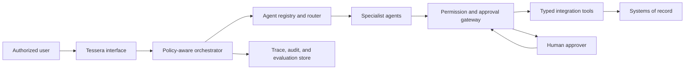

# Architecture

## System context

Tessera OS is a control plane over business systems; it is not the system of
record. Microsoft 365, HubSpot, project systems, accounting systems, and GitHub
remain authoritative. Agents receive narrowly scoped context and propose actions
through typed tool interfaces.

## Runtime flow

1. Authenticate the user and resolve tenant, role, and project scope.
2. Normalize the request into `AgentRequest`; reject unauthorized scope early.
3. Route deterministically, with model-assisted classification added only after evals.
4. Give the selected specialist a bounded objective, evidence, and allowed actions.
5. Validate structured output, citations, policy, and proposed actions.
6. If an action is gated, pause with an approval packet. Otherwise synthesize.
7. Record trace, model/prompt versions, sources, decisions, usage, and approvals.

## Orchestration choice

The orchestrator uses the manager pattern: it owns the user interaction and calls
specialists. This prevents fragmented answers, centralizes policy, and makes
cross-functional work easier to audit. Direct agent-to-agent handoffs may be added
later only for workflows whose ownership truly transfers.

## Core components

- **Registry:** loads versioned agent manifests and prompt locations.
- **Router:** transparent keyword baseline suitable for offline tests.
- **Orchestrator:** chooses a specialist and controls live execution.
- **Policy boundaries:** evaluate identity, tenant/client/project scope, approval,
  approved proposal content, and fee authority before use.
- **Tool adapters (next):** typed read/write interfaces with idempotency and audit IDs.
- **Knowledge plane:** tenant/project-filtered retrieval with source ACLs.
- **Proposal plane:** access-controlled language, versioned templates, fee schedules,
  typed sections, citations, comparisons, internal review, and DOCX generation.
- **Evaluation harness:** offline regression tests for routing, policy attacks,
  isolation, citations, approvals, and proposal commercial controls.

## Data model

Every run should carry `tenant_id`, `project_id`, `user_id`, role claims, correlation
ID, model and prompt versions, evidence IDs, allowed actions, proposed actions, and
approval state. These are security boundaries, not optional metadata.

## Production boundaries

The included runtime is intentionally a starter. Before production, add durable
identity, tenant isolation, encrypted secrets, retrieval ACL enforcement, approval
state, audit storage, integration retries, rate limits, data-loss prevention, and
operational monitoring.
