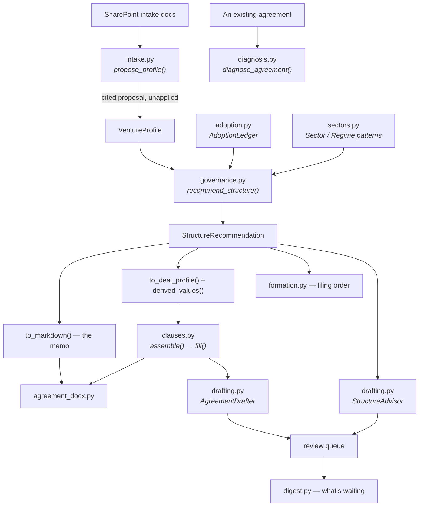

# 01 — Architecture

What calls what, and where a change belongs.

---

## The pipeline



Two paths out of one object. `to_markdown()` produces the memo a founder reads;
`to_deal_profile()` plus `derived_values()` produces the parameters the
agreement is assembled from. Setting drafting parameters by hand after giving
structural advice is how a document ends up contradicting the memo that
justified it — and `expected_clause_categories()` is the test that it cannot.

---

## Modules

| Module | Responsibility |
|---|---|
| `governance.py` | The structure engine. Deterministic: no model call, no randomness, no I/O |
| `sectors.py` | Industry and regime patterns. Pure data plus two lookups |
| `adoption.py` | The two-key ledger that upgrades a position to `tessera_adopted` |
| `clauses.py` | Clause selection, assembly, variables, cross-references, coverage |
| `diagnosis.py` | Screens an existing agreement against the position set |
| `formation.py` | Derives the filing order from a recommendation |
| `intake.py` | Proposes a venture profile from documents, with a citation per field |
| `digest.py` | What the system did, and what is waiting on a person |
| `identity.py` | Entra group mapping and trust-zone policy |
| `microsoft.py` | Connection broker and allowlisted SharePoint reads *(Codex)* |
| `portal.py` | The private named-user portal with explicit per-user project scope *(Codex)* |
| `drafting.py` | Both governed artifact paths and the hand-off between them |
| `agreement_docx.py` | Branded Word, pure Python |

### The engine's decision functions

Each is one rule with one responsibility, which is what makes them arguable one
at a time — and each is covered by a named test:

`_management_model` · `_approval_rule` · `_deadlock_needed` ·
`_ordinary_course_threshold` · `_reserved_matters` · `_buy_sell_style` ·
`_exit_architecture` · `_tax_treatment` · `_entity_layers` · `_sector_layers` ·
`_options` · `_capital_architecture` · `_recommendations` ·
`_sector_positions` · `_dual_role_positions` · `_failure_modes` ·
`_conflicts` · `_open_questions` · `_glossary` · `_apply_adoptions`

### The authorization spine

```
Entra token
  → groups claim (absent in overage → no privileged groups)
  → EntraGroupMap.resolve()            # the only door
  → UserContext.group_ids
  → required_reviewer_group            # separation of duties, enforced
  → ZonePolicy.check_read()            # zone 01 is partners-only
  → ZonePolicy.check_citation()        # the golden rule
```

Every privileged group in the production SharePoint portal enters through the
map. The production review API remains a later gate; the localhost review queue
uses only its synthetic test identity and must not be described as Entra-backed.

---

## Where a change belongs

| You want to change | Edit | Then |
|---|---|---|
| A threshold or rule | The one `_` function in `governance.py` | Update its named test and [02](02_DECISION_RULES.md) |
| What an industry needs | `sectors.py` — data only | Add a test; two generic tests already sweep every pattern |
| Clause language | `fixtures/clause_library/*.json` | Re-run the suite; refs, definitions, and parity check themselves |
| Adopt a position | `config/adopted_positions.yaml` | Protected PR approved by both partners |
| Who may review in production | A future production review API plus the Entra group map | Localhost roles are synthetic only |
| A SharePoint mapping | `TESSERA_M365_PROJECT_RESOURCES`, with its zone | An engagement zone must name its client |

---

## Deliberate constraints

**No model call in the engine.** A recommendation that varies between runs
cannot be reviewed, diffed, or defended. Judgment that genuinely needs a model
lives in `prompts/structure_manager.md` — reading an agreement, interviewing a
founder, weighing a fact pattern the profile has no field for.

**No jurisdiction database.** The engine carries a governing state through; it
does not claim to know that state's law. Jurisdiction handling lives in the
clause library's `jurisdiction_notes` and `unavailable_in` — counsel-reviewable
data rather than logic.

**No precise costs.** The `$800/entity/year` in the options menu is round and
labelled as such, and the formation checklist leaves fee cells blank. Filing
fees vary and change; a precise-looking wrong number is worse than an obvious
blank.

**Fail closed on identity.** An undeclared zone is Internal. An absent groups
claim is no privileged groups. An unmapped Entra group grants nothing.

**Backwards compatibility.** `DealProfile.management_model` defaults to `None`
and derives. `VentureProfile.tessera_is_principal` still implies the dual role.
`recommend_structure()` loads the ledger when none is passed.
